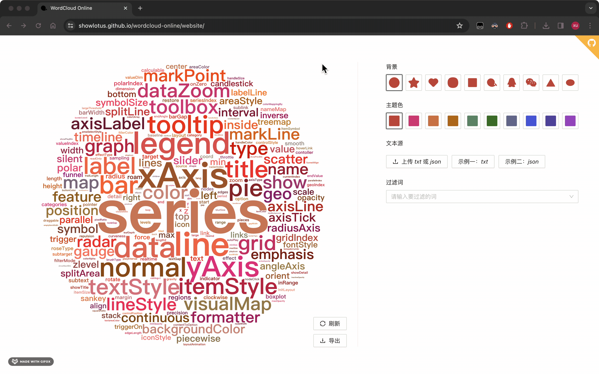
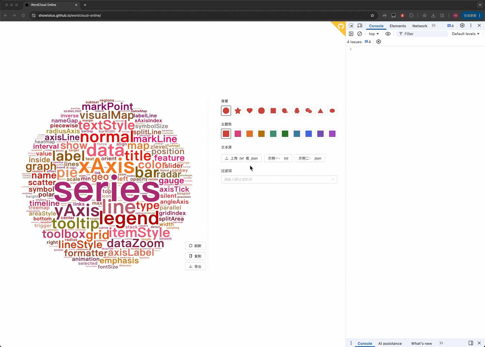
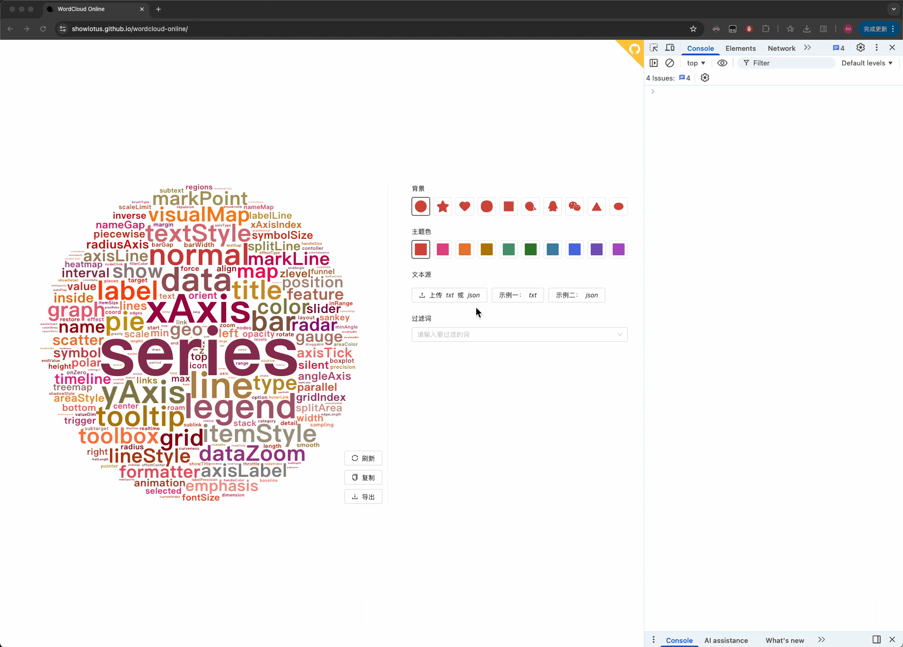

# WordCloud Online

上传一个 `txt` 或 `json` 文档，在解析文档内容后，将热词生成词云（可导出图片）。

比如，可以将微信或者 QQ 的聊天记录导出成 `txt` 格式的文档，查看你与好朋友的年度热词是哪些 ～

关于微信聊天记录的导出，可以试试另一个开源项目 [WeChatMsg](https://github.com/LC044/WeChatMsg) ~

## Changelog

词法解析改为使用 Rust + WASM + WebWorker 实现，速度提升约 10 倍。一本 70w 字的红楼梦，旧版本解析需要大约 40s，而新版本解析只需要大约 4s！

旧版本：

新版本：

